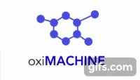

# oxiMACHINE app

[](https://github.com/kjappelbaum/oximachinetool/actions)
[](https://www.python.org/download/releases/3.6.0/)
[](https://www.gnu.org/licenses/gpl-3.0)
[](https://doi.org/10.5281/zenodo.3603606)

 </img>

> ⚠️ **Warning**: Alpha version

Flask app that uses `jsmol` to visualize the structure (and predictions). The code builds heavily on top of the implementation of the [seekpath web app](https://github.com/giovannipizzi/seekpath).

## How to run the code

You have to options to run the code: You can either clone the repository and directly run the flask app. Alternatively, can directly [use it on a Dokku pod of Materials Cloud](https://go.epfl.ch/oximachine).

### Run docker image

```
./build-docker.sh # to build the oximachine
./run_docker.sh # to run the docker image
```

The `get-apache-errorlog.sh` script can be used to debug potential issues. The `enter-docker.sh` script opens the bash in the container and can also be useful to debug issues.

### How to use the app

The use of the web app is shown in the screencast.



The app provides the option to upload a `cif` or to also choose from some examples.

# Acknowledgments

- Materials Cloud team, especially [Leopold Talirz](https://github.com/ltalirz) for help with deployment and giving valuable feedback and providing a good template.
- For parsing of the CIF we use [`c2x`](https://www.c2x.org.uk/) (GPLv3): Rutter, M. J. C2x: A Tool for Visualisation and Input Preparation for Castep and Other Electronic Structure Codes. Computer Physics Communications 2018, 225, 174–179.
- Internally, we use [pymatgen](https://pymatgen.org/): Ong, S. P.; Richards, W. D.; Jain, A.; Hautier, G.; Kocher, M.; Cholia, S.; Gunter, D.; Chevrier, V. L.; Persson, K. A.; Ceder, G. Python Materials Genomics (Pymatgen): A Robust, Open-Source Python Library for Materials Analysis. Computational Materials Science 2013, 68, 314–319.
- and [ase](https://wiki.fysik.dtu.dk/ase/) (LGPL): Larsen, A. H.; Mortensen, J. J.; Blomqvist, J.; Castelli, I. E.; Christensen, R.; Du\lak, M.; Friis, J.; Groves, M. N.; Hammer, B.; Hargus, C.; Hermes, E. D.; Jennings, P. C.; Jensen, P. B.; Kermode, J.; Kitchin, J. R.; Kolsbjerg, E. L.; Kubal, J.; Kaasbjerg, K.; Lysgaard, S.; Maronsson, J. B.; Maxson, T.; Olsen, T.; Pastewka, L.; Peterson, A.; Rostgaard, C.; Schiøtz, J.; Schütt, O.; Strange, M.; Thygesen, K. S.; Vegge, T.; Vilhelmsen, L.; Walter, M.; Zeng, Z.; Jacobsen, K. W. The Atomic Simulation Environment—a Python Library for Working with Atoms. J. Phys.: Condens. Matter 2017, 29 (27), 273002.
- The framework is built using [flask](https://flask.palletsprojects.com/en/1.1.x/)
- For visualization, we use [jsmol](https://jsmol.com/)
- Feature importance is calculated using a [SHAP TreeExplainer](https://github.com/slundberg/shap): Lundberg, S. M.; Erion, G.; Chen, H.; DeGrave, A.; Prutkin, J. M.; Nair, B.; Katz, R.; Himmelfarb, J.; Bansal, N.; Lee, S.-I. From Local Explanations to Global Understanding with Explainable AI for Trees. Nature Machine Intelligence 2020, 2 (1), 2522–5839.
- Models are trained using [sklearn](https://scikit-learn.org/): Scikit-learn: Machine Learning in Python, Pedregosa et al., JMLR 12, pp. 2825-2830, 2011.
