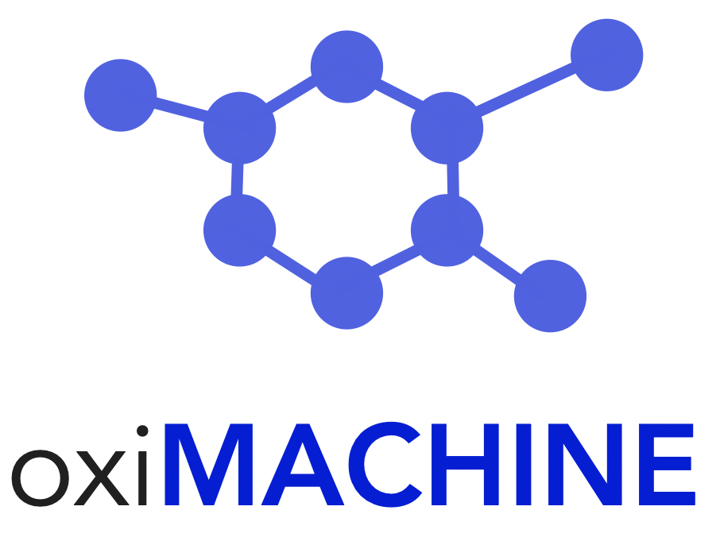

# oxiMACHINE app

[](https://github.com/kjappelbaum/oximachinetool/actions)
[](https://www.python.org/download/releases/3.6.0/)
[](https://www.gnu.org/licenses/gpl-3.0)
[](https://doi.org/10.5281/zenodo.3603606)

 </img>

> ⚠️ **Warning**: Alpha version

Flask app that uses `jsmol` to visualize the structure (and predictions). The code builds heavily on top of the implementation of the [seekpath web app](https://github.com/giovannipizzi/seekpath).

## How to run the code

You have to options to run the code: You can either clone the repository and directly run the flask app. Alternatively, can directly [use it on a Dokku pod of Materials Cloud](https://go.epfl.ch/oximachine).

### Run docker image

```
./build-docker.sh # to build the oximachine
./run_docker.sh # to run the docker image
```

The `get-apache-errorlog.sh` script can be used to debug potential issues. The `enter-docker.sh` script opens the bash in the container and can also be useful to debug issues.

### How to use the app

The use of the web app is shown in the screencast.


The app provides the option to upload a `cif` or to also choose from some examples.

# Acknowledgment

- Materials Cloud team, especially [Leopold Talirz](https://github.com/ltalirz) for help with deployment and giving valuable feedback and providing a good template.
